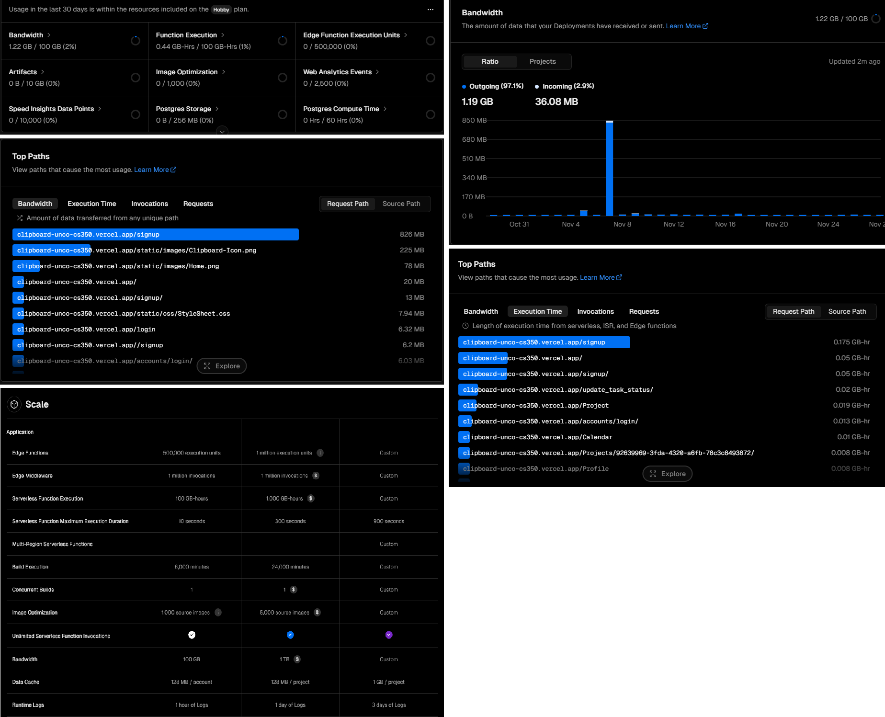
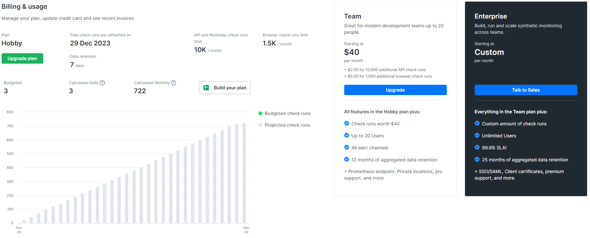

# AI Prompts - Design - Milestone 7 - Joel LeFevre

### Create a report for the devops policies to implement

DevOps Policies Implementation Report
Executive Summary
This report outlines the recommended DevOps policies to be implemented within the organization. DevOps practices facilitate collaboration between development and operations teams, fostering a culture of efficiency, speed, and continuous improvement. The proposed policies aim to streamline workflows, enhance communication, and ensure consistency across the software development lifecycle.

Objectives
Streamline Deployment Processes: Implement automated deployment pipelines to accelerate software delivery while ensuring stability.

Improve Collaboration: Foster a culture of collaboration and communication between development, operations, and other relevant teams.

Enhance Security and Compliance: Integrate security measures and compliance checks throughout the development pipeline to mitigate risks.

Promote Continuous Integration and Delivery (CI/CD): Establish and automate CI/CD pipelines to enable rapid and frequent releases.

Recommended Policies
1. Infrastructure as Code (IaC)
Policy: All infrastructure changes must be defined as code using tools like Terraform or CloudFormation.
Objective: Ensures consistency, scalability, and traceability of infrastructure changes.
2. Version Control and Branching Strategy
Policy: Utilize version control systems (e.g., Git) and define a branching strategy (e.g., GitFlow) for managing code changes.
Objective: Facilitates collaboration, tracks changes, and allows for efficient code review processes.
3. Automated Testing
Policy: Require automated testing for all code changes, including unit tests, integration tests, and end-to-end tests.
Objective: Identifies bugs early, ensures code quality, and maintains system stability.
4. Continuous Integration and Continuous Deployment (CI/CD)
Policy: Implement CI/CD pipelines to automate building, testing, and deployment processes.
Objective: Enables rapid and reliable software releases while maintaining quality.
5. Monitoring and Logging
Policy: Ensure comprehensive monitoring and logging of applications and infrastructure.
Objective: Facilitates early detection of issues, performance optimization, and proactive problem resolution.
6. Security and Compliance Automation
Policy: Integrate security checks and compliance validations into CI/CD pipelines.
Objective: Mitigates security risks and ensures adherence to regulatory requirements.
Implementation Plan
Assessment: Conduct a comprehensive assessment of existing workflows, tools, and team capabilities.

Training and Awareness: Provide training sessions and resources to familiarize teams with DevOps practices and tools.

Tool Selection and Setup: Identify and implement suitable DevOps tools aligned with the organization's needs.

Policy Rollout: Clearly communicate DevOps policies, establish guidelines, and ensure compliance across teams.

Monitoring and Optimization: Continuously monitor the implementation, gather feedback, and refine policies for optimization.

Conclusion
Adopting DevOps practices and policies can significantly enhance the organization's agility, collaboration, and efficiency in software development and deployment. By implementing these policies in a systematic manner, the company can achieve a competitive edge in delivering high-quality software while meeting business objectives.

Next Steps
Schedule a meeting to discuss policy implementation strategies.
Identify key stakeholders and allocate necessary resources.
Initiate the first phase of implementation based on outlined policies.
This report serves as a guideline for implementing DevOps policies within the organization. Adjustments and further detailing can be made based on specific organizational needs and feedback during the implementation phase.

### Explain how to scale Vercel and MongoDB to handle more users

Scaling Vercel and MongoDB to handle increased user loads involves strategies specific to each platform. Here’s an overview of scaling approaches for both:

Scaling Vercel:
Horizontal Scaling: Vercel, as a serverless platform, automatically scales based on demand. Still, optimizing for scale involves:

Caching: Leverage Vercel's caching options to reduce the load on the server and improve response times.
CDN Optimization: Utilize Content Delivery Networks (CDNs) for caching static assets closer to users, reducing latency.
Optimizing Frontend Performance:

Code Splitting: Break down large JavaScript bundles into smaller chunks for faster loading.
Image Optimization: Compress and optimize images to reduce bandwidth usage.
Serverless Function Optimization:

Concurrency Control: Manage function concurrency to handle more simultaneous requests.
Optimize Functions: Break down large functions into smaller ones for better performance.
Scaling MongoDB:
Horizontal Scaling:

Sharding: Distribute data across multiple servers (shards) based on a shard key to handle increased data volume.
Replication: Use replica sets for redundancy and scalability by distributing read operations across nodes.
Indexing and Query Optimization:

Indexing Strategy: Design efficient indexes to speed up query performance.
Query Profiling: Analyze slow queries and optimize them for better performance.
Resource Allocation:

Resource Planning: Allocate appropriate resources (CPU, memory) to handle increased user loads.
Vertical Scaling: Increase the capacity of individual nodes by upgrading hardware or switching to more powerful instances.
Connection Pooling and Caching:

Connection Pooling: Reuse database connections to reduce overhead.
Caching: Implement caching mechanisms (like Redis) to store frequently accessed data and reduce database load.
Scaling Considerations:
Monitoring and Alerts:

Set up monitoring tools to track performance metrics, anticipate bottlenecks, and receive alerts for anomalies.
Load Testing:

Conduct regular load tests to simulate increased user loads and identify system limitations.
Cost Optimization:

Review and optimize resource allocation and usage to manage costs effectively.
Database and Application Optimization:

Periodically review database and application architectures for potential optimizations.
Automated Scaling:

Implement auto-scaling configurations based on predefined thresholds to handle sudden spikes in traffic.
By implementing these strategies, you can effectively scale Vercel and MongoDB to accommodate a growing user base while ensuring performance, reliability, and cost-efficiency. Regular monitoring and optimizations are key to maintaining a scalable infrastructure.

### Describe the monitoring software to use

Several monitoring tools are available, each catering to different aspects of a system. Here's a list covering various categories:

Infrastructure Monitoring:
Prometheus: Collects metrics from configured targets, allowing for real-time monitoring and alerting based on those metrics.

Grafana: Works well with Prometheus and other data sources, providing visualization and dashboarding capabilities for metrics.

Datadog: Offers comprehensive monitoring for cloud-scale applications, covering infrastructure, applications, logs, and more.

Application Performance Monitoring (APM):
New Relic: Monitors application performance in real-time, providing insights into code-level issues, transaction traces, and bottlenecks.

AppDynamics: Offers deep insights into application performance, user experience, and business impact.

Dynatrace: Utilizes AI for root cause analysis and provides automatic detection of performance issues.

Log Management:
ELK Stack (Elasticsearch, Logstash, Kibana): Collects, analyzes, and visualizes log data for troubleshooting and monitoring purposes.

Splunk: Gathers and analyzes machine-generated data, offering insights into logs, events, and metrics.

Sumo Logic: Cloud-based log management and analytics platform offering real-time insights into logs and metrics.

Cloud-Specific Monitoring:
AWS CloudWatch: Provides monitoring for AWS resources, logs, and applications running on AWS.

Google Cloud Monitoring: Offers monitoring, alerting, and insights into Google Cloud Platform services.

Azure Monitor: Monitors Azure resources, applications, and infrastructure on the Microsoft Azure cloud.

Container and Kubernetes Monitoring:
Prometheus Operator: Specifically designed for monitoring Kubernetes clusters and applications running on them.

Kube-state-metrics: Provides insights into the state of Kubernetes objects and cluster health.

Sysdig: Offers container monitoring, security, and troubleshooting solutions for Kubernetes and cloud environments.

Network Monitoring:
Nagios: Monitors network services, hosts, and alerts system admins about issues.

PRTG Network Monitor: Monitors network devices, bandwidth, and traffic for performance and security purposes.

SolarWinds Network Performance Monitor: Provides comprehensive network monitoring, visualization, and alerting capabilities.

Considerations for Choosing Monitoring Tools:
Integration: Compatibility with the existing tech stack and ability to integrate with various services.

Scalability: Capability to scale along with the infrastructure it monitors.

Ease of Use: User-friendly interface and ease of setup and configuration.

Customization: Ability to create custom metrics, alerts, and dashboards as per specific needs.

Cost and Licensing: Consider the pricing structure and licensing agreements for the tool.

Choose a monitoring tool or combination of tools based on the specific requirements of your infrastructure, applications, and team preferences to effectively monitor and maintain system health and performance.

### Add this information to the devops report [### OMITTED CONTENTS OF CHECKLYSCALABILITY.md VERCELSCALABILITY.md and MONGODBSCALABILITY.md]

<!-- Certainly! Here's the combined report in Markdown format:

markdown
Copy code
# Scalability Report for MongoDB, Vercel, and Checkly Monitoring

## Milestone 7 - Design - Joel LeFevre

---

## MongoDB Scalability Assessment

### Current Usage Analysis
* 
  * Our current MongoDB usage stands at approximately 606 KB out of the 512MB cap on our free shared plan.
    * Our data usage could potentially grow by approximately 845 times before hitting the storage limit.

### Scaling Options Offered by MongoDB
* Reviewing [MongoDB's Pricing](https://www.mongodb.com/pricing):
  * We have the option to transition to a serverless plan offering up to 1TB of storage at $0.25 per GB-Month.
    * Read operations incur a cost of $0.10 per million times, while write operations cost $1.00 per million writes.
  * This plan includes 2 free daily backups, with additional restored backups costing $2.50/hour.

---

## Vercel Scalability Assessment

### Current Usage Overview
* 
  * Our recent usage on Vercel indicates ~400MB of data consumption within the last month, excluding a stress test that consumed ~800MB of bandwidth in November.
    * Given our 100GB cap, the site usage could expand by approximately 250 times before reaching the bandwidth limit.
  * Noteworthy insights from Vercel's built-in metrics:
    * High execution times were observed on the home page and updating task statuses in the Project page.

### Scaling Options Offered by Vercel
* Referencing [Vercel's Pricing](https://vercel.com/pricing):
  * In case of hitting the 100GB bandwidth cap, an expansion to Vercel's Pro tier at $20 per month per team member is feasible.
    * The Pro tier offers a bandwidth cap one order of magnitude higher and limited DDoS protection not available in the free tier.
  * Further scalability can be achieved with Vercel's Enterprise tier, offering custom pricing tailored to specific project needs, necessitating engagement with their sales team for specific pricing.

---

## Checkly Scalability Assessment

### Current Usage Analysis
* 
  * Presently, we execute approximately 700 checks monthly, verifying the home page's status hourly and upon each website update.
    * Alerts are triggered via email if the site experiences downtime.
  * Our current free plan permits 1,500 monthly checks, indicating that we are utilizing around 700 checks.

### Scaling Options Offered by Checkly
* Reviewing [Checkly's Billing Page](https://app.checklyhq.com/billing/):
  * Upgrading to the Pro plan at $40 per month would allow for checks every 10 minutes, offering 6,000 monthly browser checks.
    * Considering our usage, which amounts to approximately 4,400 browser checks monthly, around 1,600 checks would remain for deployment-related checks.
  * Additionally, the Pro plan unlocks various alert types, including SMS alerts, enabling quicker notifications within 10 minutes of site downtime.

---

### Conclusion

This comprehensive report outlines the scalability options available for MongoDB, Vercel, and Checkly monitoring. It provides insights into current usage, potential scalability, and associated costs for each service, ensuring a proactive approach to accommodate the growing needs of our application.

**Next Steps**
1. Evaluate the projected growth trajectory and align it with the appropriate tier upgrades in MongoDB, Vercel, and Checkly.
2. Consider cost-effectiveness and benefits for each tier upgrade to optimize resource allocation.
3. Initiate necessary upgrades to ensure seamless scalability and enhanced performance across the services.

The detailed assessments provided here offer valuable insights into scaling strategies for MongoDB, Vercel, and Checkly, essential for maintaining application reliability and performance amidst growth.
This Markdown structure combines the information about MongoDB, Vercel, and Checkly's scalability assessments into a single report format. -->